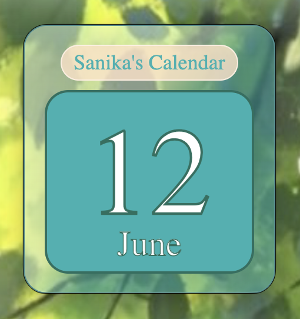

# 🗓️ Sanika's Calendar
 
A simple desktop calendar app built with **Electron** — displays today's date in a clean, minimal UI.


 
---
 
## ✨ Features
 
- Shows the current date (day and month) at a glance
- Lightweight desktop app — lives in your taskbar/dock
- Built with Electron for cross-platform support
---
 
## 🛠️ Tech Stack
 
- [Electron](https://www.electronjs.org/) — desktop app framework
- HTML / CSS / JavaScript
---
 
## 🚀 Getting Started
 
### Prerequisites
 
- [Node.js](https://nodejs.org/) (v16 or higher recommended)
- npm (comes with Node.js)

## 📁 Project Structure
 
```
sanikas-calendar/
├── main.js          # Electron main process
├── index.html       # App UI
├── package.json
└── README.md
```
 
---
 
## 🌱 First Electron Project
 
This is my first project using Electron — a fun little experiment to learn desktop app development!
